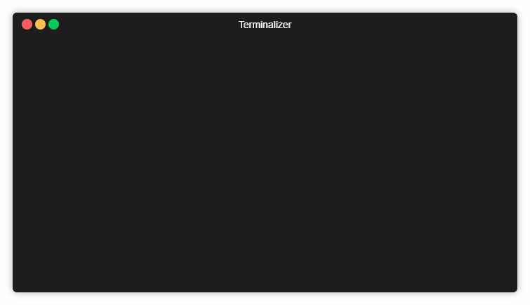
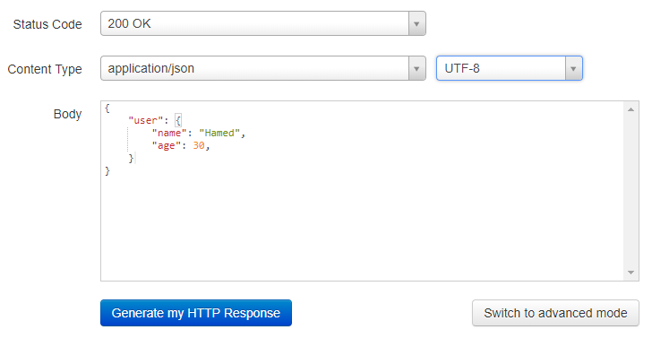
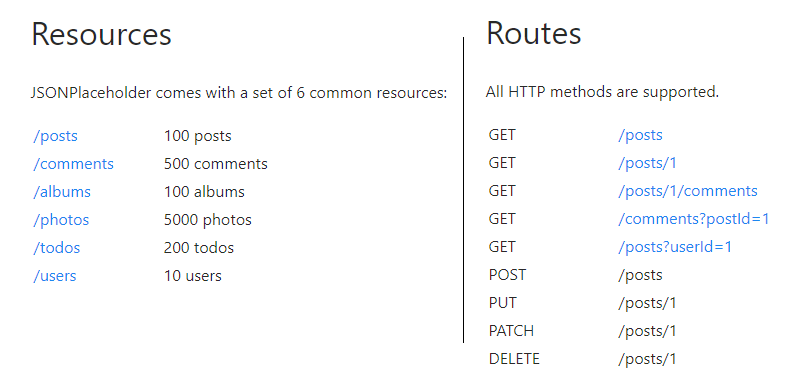
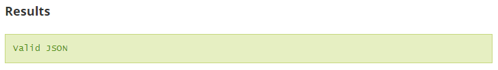
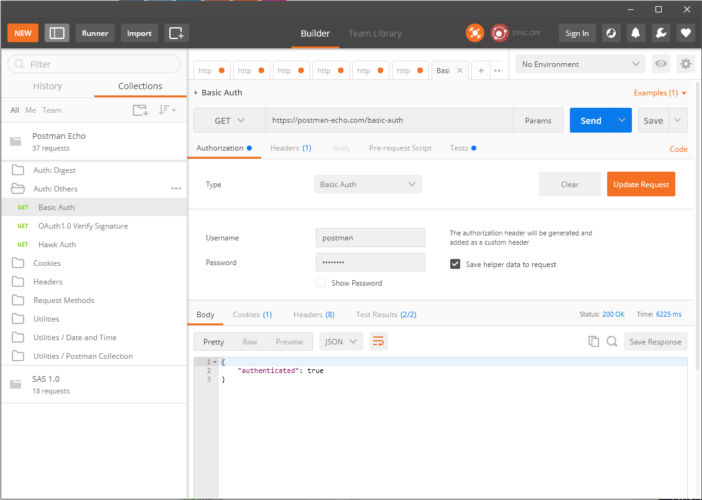
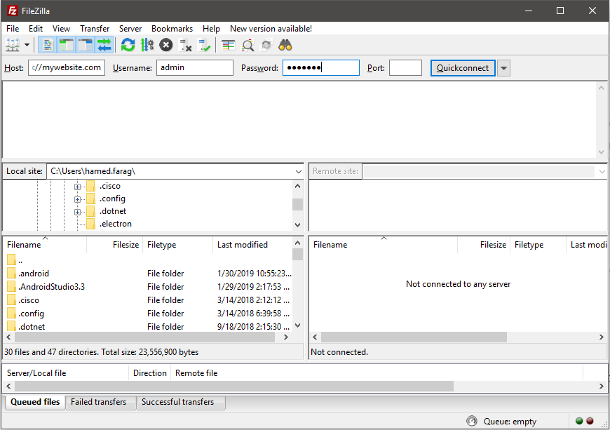
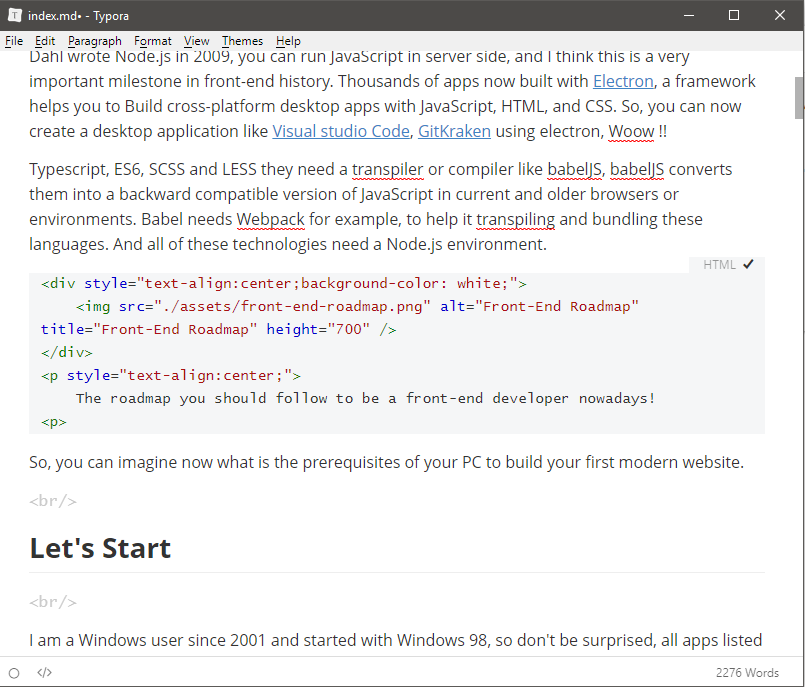
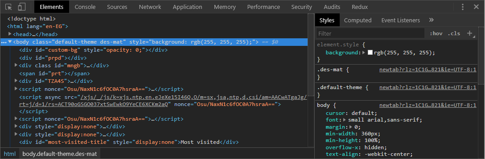
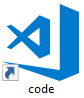

**In the dark age**, the front-end was limited - comparing with nowadays - with some libraries, plugins and simple prerequisites you need it to start the development process. 
All you need is a PC or Mac machine, notepad++ and a browser. Then you can rock the world without any fears.

A library like JQuery and its plugins for DOM manipulation, underscore for ready-made utility functions, knockout and AngularJS for binding data into DOM to create single page applications and so on, You just need a simple editor and write your code in ES5, no compiling, no parsing, no transpiling, just your skills at writing ES5, CSS and HTML.

**Today**, front-end is evolving and the JavaScript became bloated. Everything goes crazy since Ryan Dahl wrote Node.js in 2009, you can run JavaScript in server side, and I think this is a very important milestone in front-end history. Thousands of apps now built with [Electron](https://electronjs.org/), a framework helps you to Build cross-platform desktop apps with JavaScript, HTML, and CSS. So, you can now create a desktop application like [Visual studio Code](https://github.com/Microsoft/vscode), [GitKraken](https://www.gitkraken.com/) using electron, Woow !!

Typescript, ES6, SCSS and LESS they need a transpiler or compiler like babelJS, babelJS converts them into a backward compatible version of JavaScript in current and older browsers or environments. Babel needs Webpack for example, to help it transpiling and bundling these languages. And all of these technologies need a Node.js environment.

<div style="text-align:center;background-color: white;">
    
</div>
<p style="text-align:center;">
    The roadmap you should follow to be a front-end developer nowadays!
<p>

So, you can imagine now what is the prerequisites for your PC to build your first modern website.

<br/>

## Let's Start


I am a Windows user since 2001 and started with Windows 98, so don't be surprised, all apps listed below related to this OS and trying to make windows more powerful.

We will start with applications that we can consider it as infrastructure apps to convert your machine from normal one to a front-end powerful machine.

<br/>

### Infrastructure

#### [Node.JS](https://nodejs.org/en/)

Node.js is an open-source, cross-platform JavaScript run-time environment that executes JavaScript code outside of a browser. Node.js lets developers use JavaScript to write command line tools and for server-side scripting—running scripts server-side to produce dynamic web page content before the page is sent to the user's web browser. Node.js was originally written by Ryan Dahl in 2009.

In January 2010, a package manager was introduced for the Node.js environment called npm.

Built on [Chrome's V8 JavaScript engine](https://developers.google.com/v8/).

Node.js is the first thing you need to setup, so you can run any tool you need in the development process. Gulp, Grunt, Webpack, Parcel, Rollup almost every tool based on JS that run on server side need Node.js.

The default package manager of Node.js called **npm**, believe it or not, **npm** not means **node package manager**, this name called by the community and the creator of **npm** not announced the mean of it, there is a funny [repo on github](https://github.com/npm/npm-expansions), the community submit the meaning of **npm** and appear in the header of the [npmjs.com](https://npmjs.com/) website.

<div style="text-align:center;">
    
</div>

##### What is NPM?

In the days before package managers, it was commonplace for JavaScript engineers to rely on a small number of dependencies stored directly in their projects or served by a CDN. The first major JavaScript package manager, npm, was built shortly after Node.js was introduced, and it quickly became one of the most popular package managers in the world. Thousands of new open source projects were created and engineers shared more code than ever before.

The primary function of any package manager is to install some package — a piece of code that serves a particular purpose — from a global registry into an engineer's local environment. Each package may or may not depend on other packages. A typical project could have tens, hundreds, or even thousands of packages within its tree of dependencies.

You can [download](https://nodejs.org/en/download/) Node.js and start testing your JavaScript skills directly in the console.

<div style="text-align:center;">
    
</div>


#### [Yarn](https://yarnpkg.com/lang/en/)

**Yarn** is a new package manager that replaces the existing workflow for the npm client or other package managers while remaining compatible with the npm registry. It has the same feature set as existing workflows while operating faster, more securely, and more reliably.

**Yarn** is optional for me and I am very satisfied with **npm** at least for now.


#### [windows-build-tools](https://github.com/felixrieseberg/windows-build-tools)

My first time to deal with sass, I wasn't able to compile sass or scss files using task runner called **gulp**, after reading the error in the console carefully and a lot of searching, the node-sass package wasn't compiled successfully on my machine. Why? node-sass depends on package called **node-gyp** and this package has a prerequisite.

The prerequisite is a build tool for windows to compile native Node modules, called **windows-build-tools** and this tool install and configure the following

* Visual C++ Build Environment
* Python  2.7
* Launch cmd, `npm config set msvs_version 2017`

Note: You can install the above points manually and it will do the same job to compile node-gyp package.

<br/>

### Utilities

#### [Cmder](https://cmder.net/)

I don't like the default terminal that developed by Microsoft, the CMD. It is limited and you cannot customize it easily. I searched for a replacement and I found a terminal called **Cmdr**.

**Cmdr** is a portable console emulator for Windows.

**Cmder** is a software package created out of pure frustration over absence of usable console emulator on Windows. It is based on **ConEmu** with major config overhaul, comes with a Monokai color scheme, amazing clink (further enhanced by clink-completions) and a custom prompt layout.

##### Why use Cmdr?

The main advantage of Cmder is portability. It is designed to be totally self-contained with no external dependencies, which makes it great for USB Sticks or cloud storage. So you can carry your console, aliases and binaries (like wget, curl and git) with you anywhere.

The Cmder's user interface is also designed to be more eye pleasing.

* You can change the default colors, fonts.
* Shortcuts out of the box.
* Open more than one terminal with different types (CMD, PowerShell and Bash) per window (Tabs).
* You can rename the tabs.

#### [Terminalizer](https://terminalizer.com/)

A helpful utility that record your terminal and generate animated gif images or share a web player. Why we can use something like that? You may want to share steps to configure something with your workmate, You can also record your routine commands to share with a newcomer in your team or you want to share something for fun.

<div style="text-align:center;">
    
</div>

Steps are very simple

1. `npm install -g terminalizer`

2. Then write `terminalizer record demo` demo is the name of this record

3. if you want to edit the record, all record configuration saved into file called `demo.yml`, you can open it and edit frames, adjust delays, customize the colors, font, window frame, apply custom styles using CSS, etc. You can open it into the terminal by typing `vim demo.yml` 

4. `terminalizer play demo` if you want to play it in the terminal.

5. `terminalizer render demo` to generate gif image.

6. Terminal will print the path of the output gif.

<br/>

### Mocking

Mocking is primarily used in unit testing. An object under test may have dependencies on other (complex) objects. To isolate the behavior of the object you want to replace the other objects by mocks that simulate the behavior of the real objects. This is useful if the real objects are impractical to incorporate into the unit test.

But in this section, we will talk about API Mocking.

##### What is API Mocking?

The most common term for creating simulated APIs is mocking. The basic concept is  - instead of using an actual API –  a “replacement” version of that API is created and used instead. It behaves as the original API but lacks many of the functional and non-functional characteristics of the original component. 

How can we mock the APIs for development purpose? We can mock it in your machine or use an online tool.

#### [Mocky](https://www.mocky.io/)

Mock your HTTP responses to test your REST API

Write your custom response and **mocky** will generate for you an URL you can use it normally as the real API.

<div style="text-align:center;">
    
</div>

#### [JsonPlaceholder](https://jsonplaceholder.typicode.com/)

Fake Online REST API for Testing and Prototyping.

JSONPlaceholder is a free online REST API that you can use whenever you need some fake data. 
It's great for tutorials, testing new libraries, sharing code examples, ...

<div style="text-align:center;">
    
</div>

#### [json-server](https://github.com/typicode/json-server)

Get a full fake REST API with **zero coding** in **less than 30 seconds**.

Created with  ❤ for front-end developers who need a quick back-end for prototyping and mocking.

Json-server gives you the full power to fake the APIs you need for development purpose, with all customization that you may need it so simulate everything.

```
Options:
  --config, -c       Path to config file           [default: "json-server.json"]
  --port, -p         Set port                                    [default: 3000]
  --host, -H         Set host                             [default: "localhost"]
  --watch, -w        Watch file(s)                                     [boolean]
  --routes, -r       Path to routes file
  --middlewares, -m  Paths to middleware files                           [array]
  --static, -s       Set static files directory
  --read-only, --ro  Allow only GET requests                           [boolean]
  --no-cors, --nc    Disable Cross-Origin Resource Sharing             [boolean]
  --no-gzip, --ng    Disable GZIP Content-Encoding                     [boolean]
  --snapshots, -S    Set snapshots directory                      [default: "."]
  --delay, -d        Add delay to responses (ms)
  --id, -i           Set database id property (e.g. _id)         [default: "id"]
  --foreignKeySuffix, --fks  Set foreign key suffix, (e.g. _id as in post_id)
                                                                 [default: "Id"]
  --quiet, -q        Suppress log messages from output                 [boolean]
  --help, -h         Show help                                         [boolean]
  --version, -v      Show version number                               [boolean]
```

Steps to deal with it

1. `npm install -g json-server`

2. Create a `db.json` file with some data

   ``````json
   {
     "posts": [
       { "id": 1, "title": "json-server", "author": "typicode" }
     ],
     "comments": [
       { "id": 1, "body": "some comment", "postId": 1 }
     ],
     "profile": { "name": "typicode" }
   }
   ``````

3. `json-server --watch db.json`

4. Now if you go to <http://localhost:3000/posts/1>, you'll get

   ``````json
   { "id": 1, "title": "json-server", "author": "typicode" }
   ``````


#### [JsonLint](https://jsonlint.com/)

JSONLint is a validator and reformatter for JSON, a lightweight data-interchange format.

This is an online tool to validate your JSON document, to make sure that you JSON document is validate and will not crashed.

<div style="text-align:center;">
    
</div>

<br/>

### Applications

#### [Postman](https://www.getpostman.com/)

You want to test your APIs, the real one or the fake APIs that your created with the above tools, with Postman you can test any Restful APIs.

Postman is a powerful HTTP client for testing web services. Created by Abhinav Asthana, a programmer and designer based in Bangalore, India, Postman makes it easy to test, develop and document APIs by allowing users to quickly put together both simple and complex HTTP requests.

Features

1. Easy-to-use Interface
2. History and autocomplete
3. Easy Organization
4. Response reviewer
5. Test editor 
6. Collection Runner
7. Create collection of APIs tests and share it. 

<div style="text-align:center;">
    
</div>


#### [Filezilla](https://filezilla-project.org/)

##### What is FTP?

The File Transfer Protocol (FTP) is a standard network protocol used for the transfer of computer files between a client and server on a computer network.

FileZilla is a free software, cross-platform FTP application, consisting of FileZilla Client and FileZilla Server. Client binaries are available for Windows, Linux, and macOS, server binaries are available for Windows only. Both server and client support FTP and FTPS (FTP over SSL/TLS), while the client can in addition connect to SFTP servers.

##### Why to us it?

If you are usually dealing with a website as admin to upload and download files but you tired from Website Admin Panel. Filezilla will make the process of uploading and downloading file more easily and more efficient .

<div style="text-align:center;">
    
</div>


#### [Notepad++](https://notepad-plus-plus.org/)

Do you like using notepad, I think it is the time to use Notepad++.

Notepad++ is a free source code editor and Notepad replacement that supports several languages. 

I remember my friend when I asked him what is the preferred editor which you usually use when you develop a website in PHP language. I was shocked by his answer, notepad ++.

I usually use Notepad++ to take a quick note, save quick commands to use it later in the terminal, edit file quickly and so on.


#### [Typora](https://typora.io/)

If you used to write a documentation of your code, I think you write it in markdown format.

Typora is a tool designed to make markdown source code easier for both writers and readers. 

Its main function is to replace the clutter of the typical markdown interface with something more direct and intuitive. The usual preview window, the mode switcher and other unnecessary features will be gone, replaced with a live preview window.

<div style="text-align:center;background-color: white;">
    
</div>


#### [Chrome DevTools](https://developers.google.com/web/tools/chrome-devtools/)

Chrome DevTools is a set of web developer tools built directly into the **Google Chrome browser**. DevTools can help you edit pages on-the-fly and diagnose problems quickly, which ultimately helps you build better websites, faster.

Inspect Elements, Debugging, Measuring your Website Performance, Local Storage, Cookies. Everything related to your website you can monitor it using this tool.

Of course you need to install Google chrome to use this DevTools.

<div style="text-align:center;background-color: white;">
    
</div>

<br/>
<br/>

### Tips and Tricks 

If you're a Windows user like me, I think this trick would be useful if your typing on the keyboard is  fast enough.

Steps

1. Create a shortcut for your favorite application like **Visual Studio Code** and rename it to **code** for example.

<div style="text-align:right;background-color: white;">
    
</div>

2. Move this shortcut to `C:\Windows`

3. try to hit `CTRL + R` then write `code`

4. Visual Studio Code will open normally :D.

5. Repeat Steps 1 and 2 for your favorite app.

---

**Next Steps**

In the next article, we will continue our modern setup to convert your machine to an awesome front-end machine.